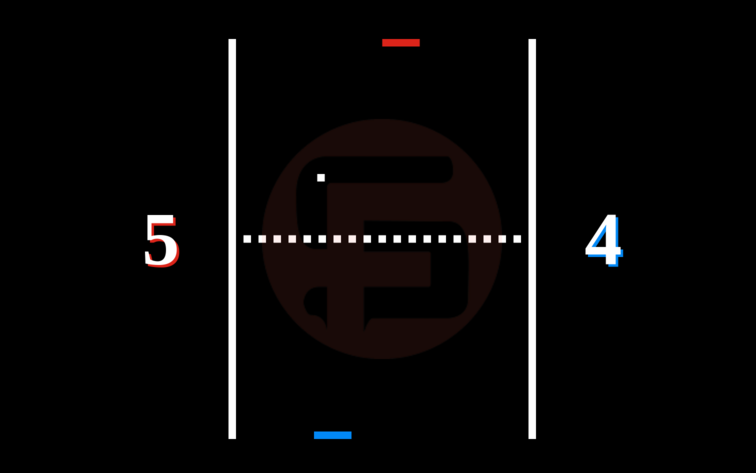

# Pong

# Descrição do Projeto

O Pong Multiplayer é um projeto que visa colocar duas pessoas, em celulares distintos, para jogarem uma contra a outra enquanto uma tela
exibe a disputa dos players. Utilizando-se da tecnologia de Socket.io para realizar a comunicação de todas as partes envolvidas, a construção
do jogo é feita apenas com HTML, CSS, JavaScript e NodeJS.

# Status do Projeto
Status: Em Desenvolvimento

# Funcionalidades e Demonstração da Aplicação
O projeto disponibiliza para duas pessoas uma disputa do jogo pong de forma online ou localmente, cada um utilizando seu celular para ter controle
de sua barrinha

# Instruções de Uso
Para jogar o pong localmente, deve ser feito o clonamento deste repositório.
1. `git clone`
Após isso, executar no terminal, os comandos:
2. `npm install`
3. `npm start`
A primeira aba a ser acessada deve ser a /tela para a visualização do jogo, depois, basta abrir dois navegadores na mesma hospedagem e os controles já estaram conecatados a tela e o jogo poderá ser jogado

# Acesso ao Projeto (Link do Projeto)
[Pong](https://pong.fabsoftware.itp.ifsp.edu.br/)

# Contribuição/Autores
- Vitor Gabriel Cavalheiro
